# Конструктор HTML-рассылок

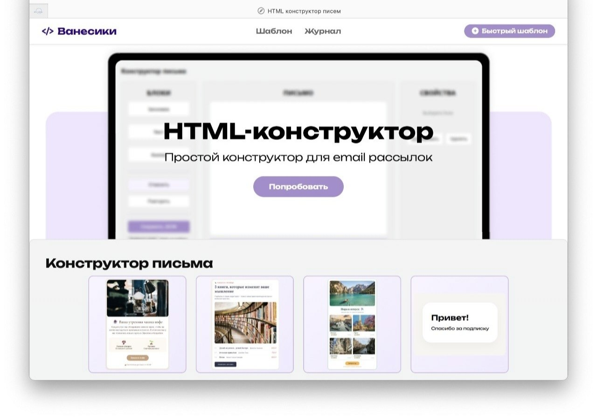

**Конструктор HTML-рассылок** — демонстрационная информационная система для визуального создания HTML-писем, работы с базой заказчиков 1С, предпросмотра письма, сохранения HTML-шаблонов и ведения журнала отправок.

Проект относится к области **маркетинга и email-коммуникаций** и решает задачу упрощения подготовки email-кампаний: пользователь может собрать письмо без ручной HTML-верстки, выбрать заказчика из базы 1С, проверить итоговый вид письма и зафиксировать результат в журнале. Я тимлид данного проекта, отвечала за планирование задач, координацию, документацию и интеграцию frontend и backend. 

---

## Содержание

- [О проекте](#о-проекте)
- [Возможности](#возможности)
- [Скриншоты интерфейса](#скриншоты-интерфейса)
- [Диаграммы](#диаграммы)
- [Технологический стек](#технологический-стек)
- [Структура проекта](#структура-проекта)
- [Документация](#документация)
- [Запуск проекта](#запуск-проекта)
- [Команда](#команда)
- [Планы развития](#планы-развития)

---

## О проекте

Система объединяет несколько ключевых процессов подготовки рассылки:

- визуальную сборку HTML-шаблона;
- редактирование блоков письма;
- работу с данными заказчиков из 1С;
- предпросмотр итогового письма;
- сохранение и загрузку HTML-шаблонов;
- симуляцию отправки;
- отображение журнала и статусов.

Проект является **демонстрационной версией** сервиса, поэтому часть возможностей имитируется или реализована в учебно-демонстрационном формате.

---

## Возможности

### Конструктор HTML-шаблонов

- создание письма из готовых блоков;
- добавление заголовка, текста, изображения и ссылки;
- редактирование параметров выбранного элемента;
- изменение шрифта, размера, цвета и выравнивания;
- дублирование и удаление блоков;
- создание письма с нуля или работа с готовым шаблоном.

### Работа с заказчиками

- получение списка клиентов из базы 1С;
- выбор клиента в интерфейсе;
- автоматическое заполнение ФИО, телефона и email;
- добавление нового заказчика;
- передача данных между веб-приложением и 1С через HTTP-сервис.

### Предпросмотр и шаблоны

- просмотр итогового письма перед отправкой;
- сохранение HTML-шаблона;
- загрузка ранее подготовленного HTML-файла;
- хранение пользовательских шаблонов.

### Журнал

- фиксация тестовых отправок;
- отображение времени отправки;
- отображение получателя;
- отображение темы письма;
- отображение статуса отправки.

---

## Скриншоты интерфейса

### Главный экран


### Редактирование шаблона

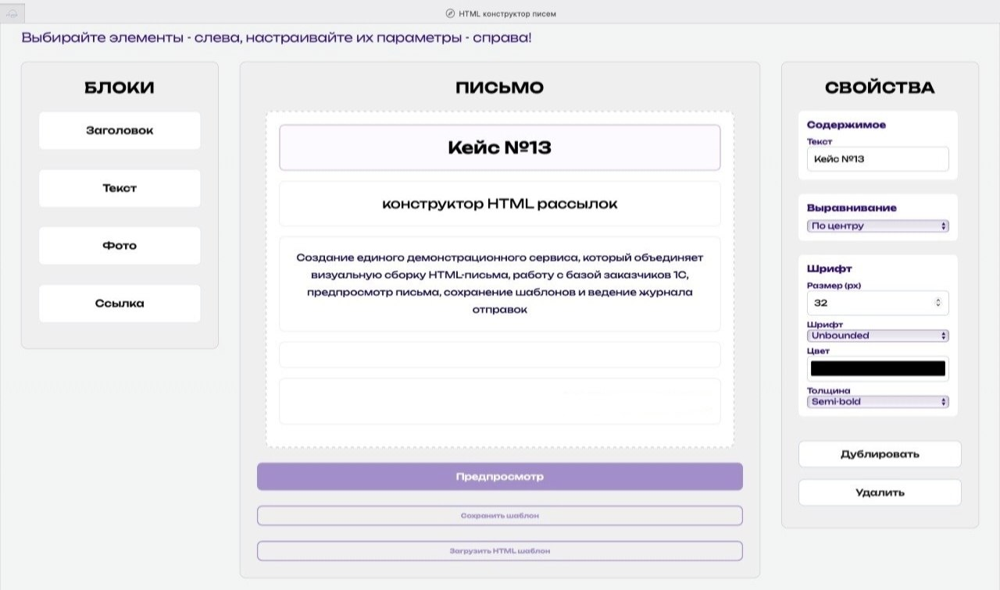

### Данные заказчика и предпросмотр

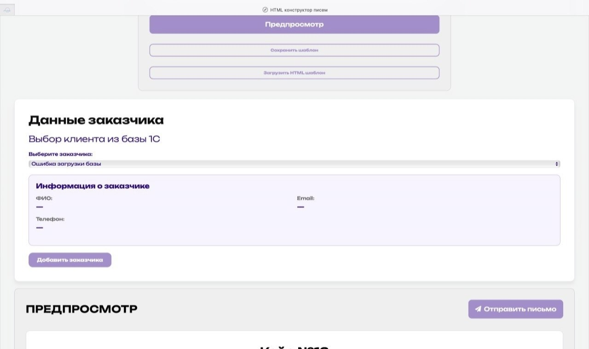

### Предпросмотр письма

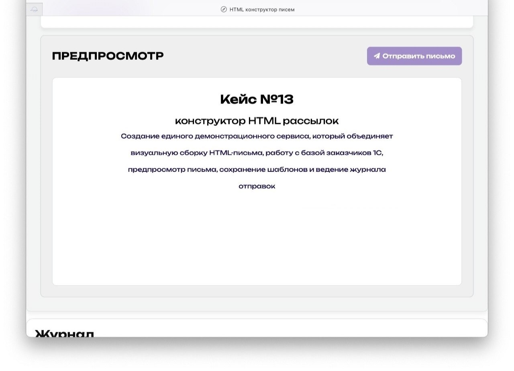

### Журнал отправок

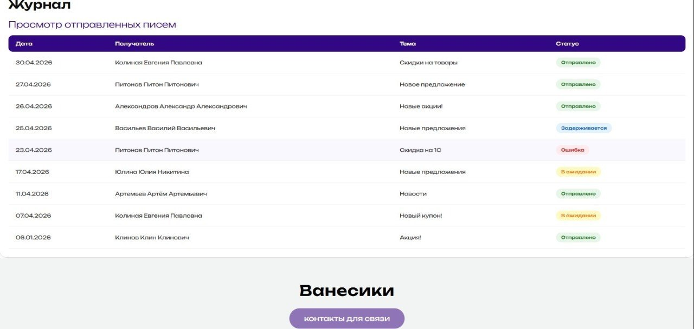

### Контакты руководства

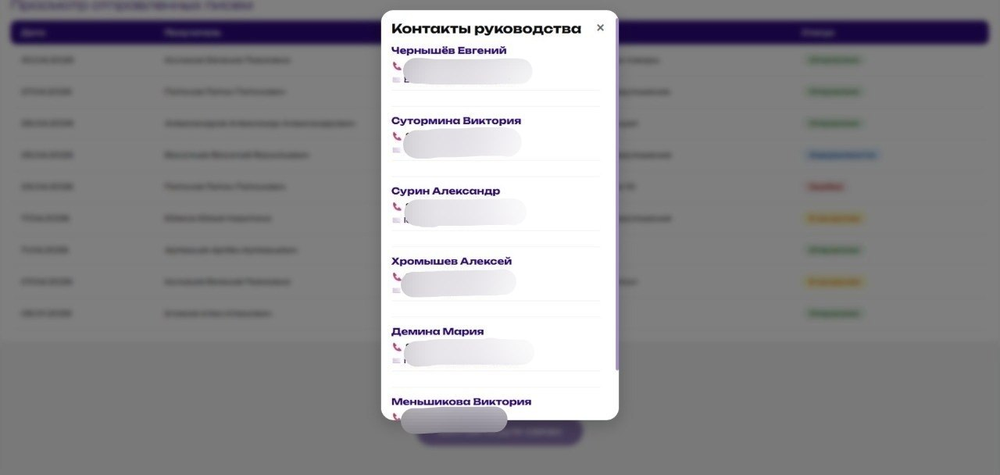

### База клиентов в 1С

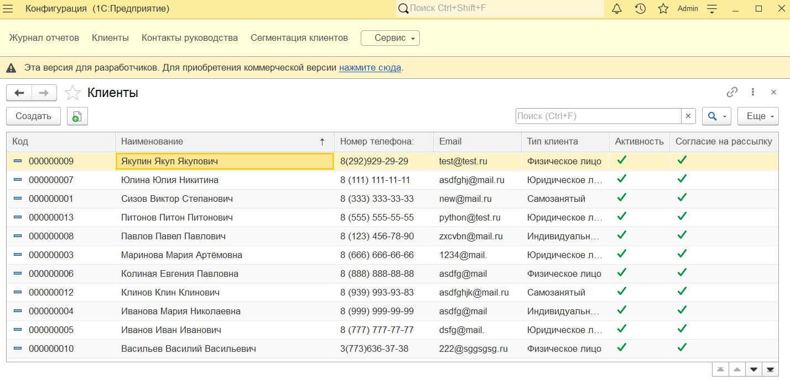

---

## Диаграммы

### BPMN-диаграмма процесса подготовки рассылки

Диаграмма показывает общий процесс работы сервиса: открытие интерфейса, выбор или создание шаблона, редактирование, предпросмотр, загрузку данных клиентов, сегментацию получателей, симуляцию отправки, формирование журнала и отображение результата пользователю.

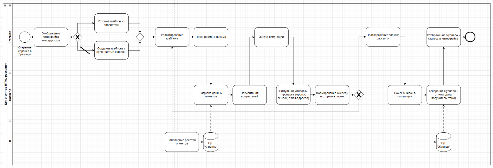

### ERD / диаграмма классов

Диаграмма описывает основные сущности проекта: шаблоны, рассылки, клиентов, клиентские сегменты, журнал, статусы, типы клиентов и контакты.

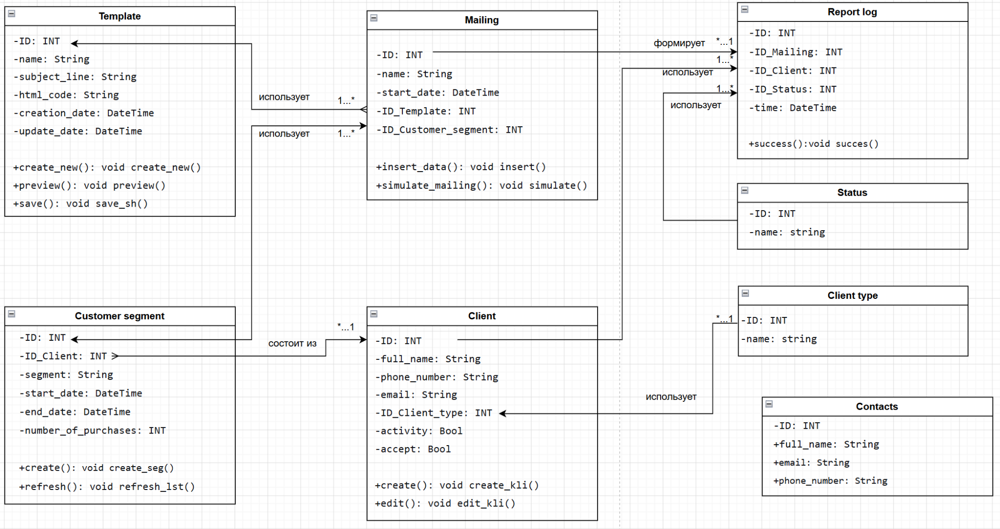

---

## Технологический стек

| Часть проекта | Технологии |
|---|---|
| Frontend | HTML5, CSS3, JavaScript |
| Backend | Python, Flask |
| Интеграция | HTTP-сервис 1С |
| База данных | 1С:Предприятие 8.5 |
| Веб-сервер для публикации 1С | IIS |
| Формат шаблонов | HTML |
| Локальный запуск | `http://127.0.0.1:5000` |

---

## Архитектура

```text
Пользователь
    │
    ▼
Frontend: HTML / CSS / JavaScript
    │
    ▼
Backend: Python / Flask
    │
    ▼
HTTP-сервис 1С
    │
    ▼
База заказчиков 1С
```

Frontend отвечает за интерфейс конструктора, работу с блоками, визуальное редактирование и взаимодействие пользователя с шаблоном.

Backend на Flask обрабатывает запросы, связывает интерфейс с 1С, получает данные клиентов, передает данные нового заказчика и работает с журналом.

1С используется как основная база заказчиков и источник данных для рассылки.

---

## Структура проекта

```text
.
├── app.py
├── index.html
├── style.css
├── sc.js
├── database.db
├── res/
├── uploads/
├── saved_templates/
├── docs/
│   ├── images/
│   │   ├── site-home.png
│   │   ├── site-editor.png
│   │   ├── site-customer-preview.png
│   │   ├── site-email-preview.png
│   │   ├── site-journal.png
│   │   ├── site-contacts.png
│   │   └── onec-clients.png
│   └── diagrams/
│       ├── bpmn-process.png
│       └── erd-class-diagram.png
├── Инструкция пользователя.docx
├── Инструкция администратора.docx
├── Требования.docx
├── УСТАВ ПРОЕКТА.docx
├── КАРТОЧКА ПРОЕКТА.docx
├── Анализ_конкурентов.xlsx
└── Конструктор HTML-рассылок.dt
```

### Назначение основных файлов и папок

| Элемент | Назначение |
|---|---|
| `app.py` | Backend приложения на Flask, маршруты и интеграция с 1С |
| `index.html` | Основная HTML-страница интерфейса |
| `style.css` | Стили пользовательского интерфейса |
| `sc.js` | JavaScript-логика конструктора |
| `database.db` | Локальная база / служебные данные проекта |
| `res/` | Ресурсы интерфейса, изображения, логотипы |
| `uploads/` | Загруженные пользователем изображения |
| `saved_templates/` | Сохраненные HTML-шаблоны |
| `docs/images/` | Скриншоты интерфейса и изображения для README |
| `docs/diagrams/` | BPMN, ERD и другие диаграммы |
| `Конструктор HTML-рассылок.dt` | Файл выгрузки 1С |

---

## Документация

В репозитории размещены документы, которые описывают проект с разных сторон.

| Документ | Назначение |
|---|---|
| `КАРТОЧКА ПРОЕКТА.docx` | Цель проекта, критерии успеха, границы проекта, ценность для бизнеса |
| `УСТАВ ПРОЕКТА.docx` | Роли, зоны ответственности, сроки, roadmap, риски и план работ |
| `Требования.docx` | Требования к продукту на основе анализа конкурентов |
| `Инструкция пользователя.docx` | Описание работы с интерфейсом конструктора |
| `Инструкция администратора.docx` | Установка, настройка 1С, IIS, Flask и интеграции |
| `Анализ_конкурентов.xlsx` | Материалы анализа конкурентных решений |

### Визуальные материалы из документации

#### Карточка проекта

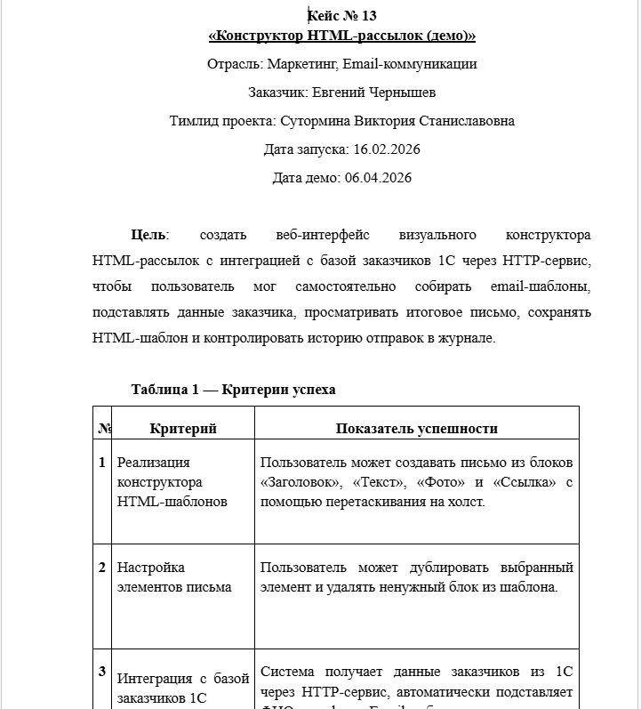

#### Устав проекта

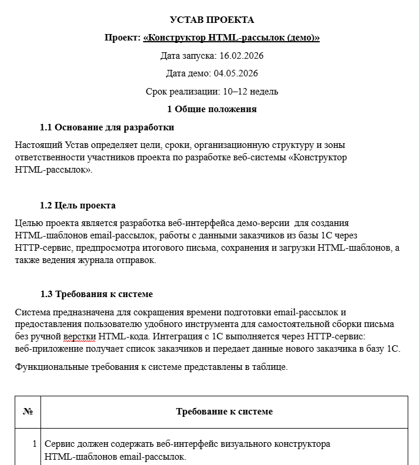

#### Инструкция администратора

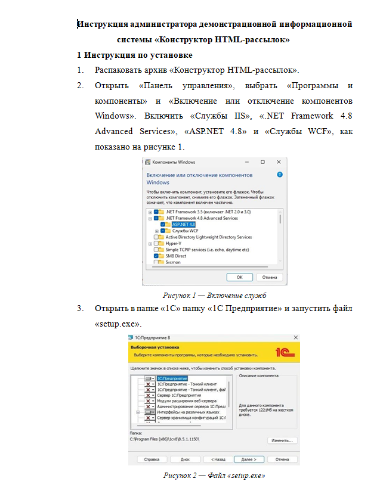

#### Инструкция пользователя

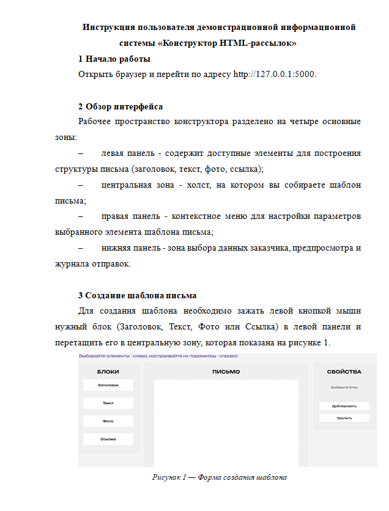

---

## Запуск проекта

### 1. Подготовка окружения

Необходимо установить:

- Python 3.10 или выше;
- Flask;
- 1С:Предприятие 8.5;
- IIS для публикации HTTP-сервиса 1С.

### 2. Настройка 1С

Для корректной работы интеграции необходимо:

1. Развернуть информационную базу 1С.
2. Опубликовать HTTP-сервис.
3. Проверить адрес опубликованной базы.
4. При необходимости изменить URL в `app.py` для маршрутов, которые обращаются к 1С.

### 3. Запуск backend

В корневой папке проекта выполнить:

```bash
python app.py
```

После запуска приложение будет доступно по адресу:

```text
http://127.0.0.1:5000
```

---

## Пользовательский сценарий

1. Пользователь открывает сервис в браузере.
2. Выбирает готовый шаблон или создает письмо с нуля.
3. Добавляет и редактирует блоки письма.
4. Выполняет предпросмотр шаблона.
5. Загружает данные заказчиков из 1С.
6. Выбирает получателя или добавляет нового клиента.
7. Запускает симуляцию отправки.
8. Система формирует журнал.
9. Пользователь видит статус отправки в интерфейсе.

---

## Команда

Проект разработан командой из **5 человек**.

| Участник | Роль | Зона ответственности | GitHub |
|---|---|---|---|
| Виктория Сутормина | Team Lead / Fullstack | Планирование, координация, документация, интеграция frontend и backend | https://github.com/Vikki122222 |
| Мария Демина | Аналитик | Требования, ТЗ, критерии успеха, диаграммы | https://gitverse.ru/misaam |
| Виктория Меньшикова | Frontend / Fullstack | Интерфейс, страницы конструктора, форма создания шаблонов | https://github.com/menvika |
| Алексей Хромышев | Backend / Fullstack | Серверная логика, журнал, интеграция данных заказчиков, сохранение и загрузка шаблонов | https://github.com/Al3xKhrom |
| Александр Сурин | 1С-разработчик | База 1С, HTTP-сервис, интеграция с веб-приложением | https://gitverse.ru/lat_ech |

---

## Границы демонстрационной версии

В текущей версии реализованы ключевые функции демонстрационного сервиса:

- визуальный конструктор HTML-шаблонов;
- интеграция с базой заказчиков 1С;
- добавление нового заказчика;
- предпросмотр письма;
- сохранение и загрузка HTML-шаблонов;
- журнал тестовых отправок;
- пользовательская и администраторская документация.

Возможности, которые могут быть вынесены в дальнейшее развитие:

- полноценная SMTP-отправка писем;
- расширенная сегментация клиентов;
- персонализация контента письма;
- аналитика по открытиям и кликам;
- авторизация пользователей;
- роли и права доступа;
- мобильная адаптация интерфейса.

---

## Планы развития

- Добавить авторизацию пользователей.
- Расширить библиотеку готовых шаблонов.
- Реализовать полноценную SMTP-отправку.
- Добавить расширенную аналитику рассылок.
- Реализовать сегментацию клиентской базы.
- Добавить адаптивную версию интерфейса.
- Улучшить обработку ошибок интеграции с 1С.
- Расширить набор блоков конструктора.

---

## Статус проекта

**Демонстрационная версия завершена.**

Проект подготовлен для демонстрации основного пользовательского сценария: создание HTML-письма, работа с данными заказчиков из 1С, предпросмотр, сохранение шаблона и отображение журнала отправок.
